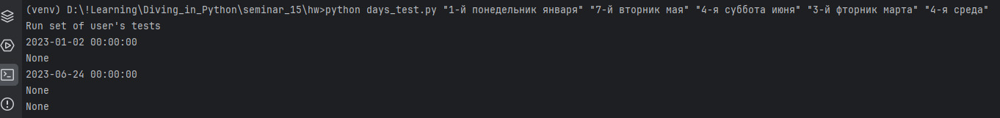

# Погружение в Python

Возьмите любые 1-3 задания из прошлых домашних заданий. 
Добавьте к ним логирование ошибок и полезной информации. 
Также реализуйте возможность запуска из командной строки с передачей параметров.

Логирование реализуется через класс-декоратор, записывающий состояние операции, 
время выполнения, переданные параметры и результат работы логируемого метода.

## Задача 1
Доработка задачи с датами с семинара 15.
Функция получает на вход текст вида:

“2-й четверг февраля”
“3-я суббота июня” и т.п.
Преобразуйте его в дату в текущем году. Логируйте ошибки, если текст не соответствует формату.

Работа парсера настроена на выполнение задач из командной строки, но если данные 
для работы пользователем не переданы - будет выполнен разбор тестовых данных, заданный по умолчанию.

### Примеры выполнения

Вызов из командной строки

Логи

## Задача 2

Задача о студентах (12-й семинар). Логирование операции добавления дисциплин и сохранения данных в файл. 
Для логирования используется декоратор. Работа производиться через командную строку. 

### Пример выполнения

Вызов программы

Логи

